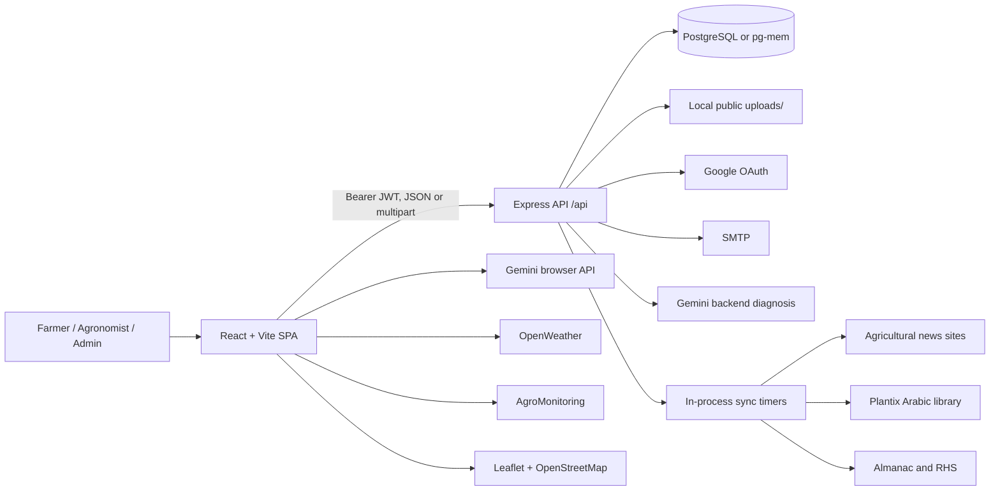
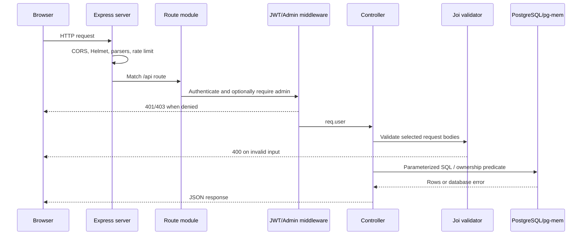
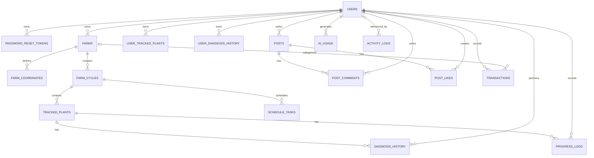
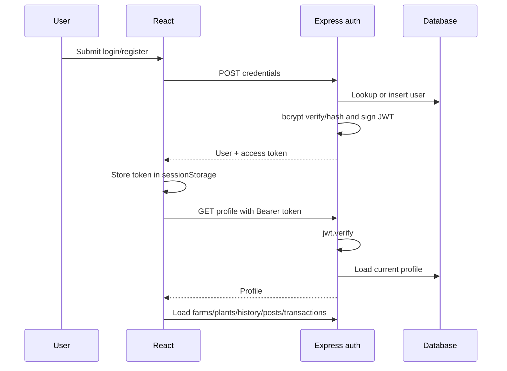
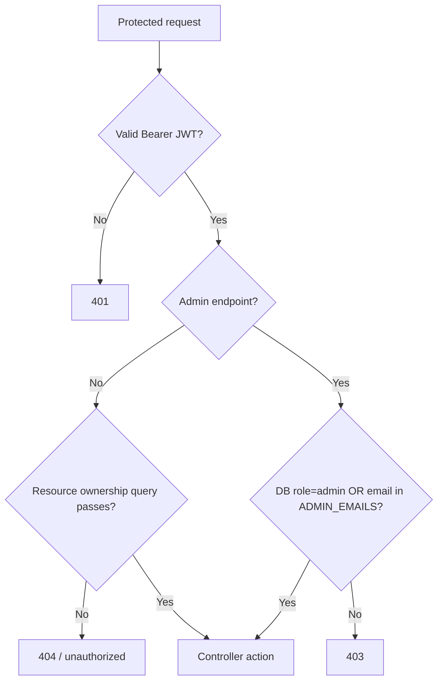
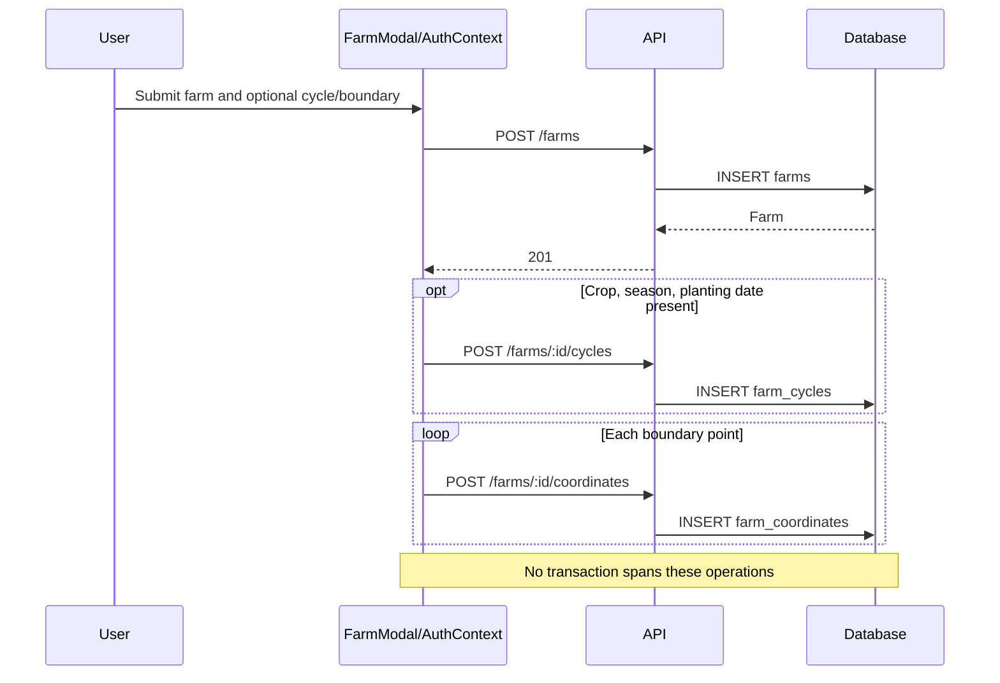
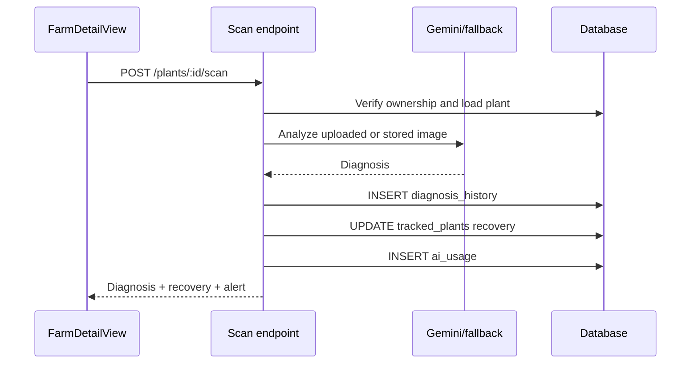
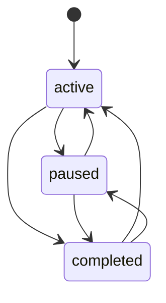

# Agricultural Vision Mind Project Knowledge Base

> Evidence snapshot: 2026-06-14  
> Repository root: `C:\Users\omar\Desktop\project\Agricultural Vision Mind project\Agricultural Vision Mind`  
> Scope: root configuration, the active frontend and backend, public assets, tests, documentation, and the excluded `archive` folder were inventoried. Dependency folders, generated `dist`, logs, and uploaded binary content were excluded except where their configuration or existence affected behavior.
>
> Path convention: paths beginning with `backend/` are shorthand for files under the nested backend project; all other relative paths are rooted at the repository path above.

## Core Fixes Update

The source was re-inspected and the following changes were implemented and verified on 2026-06-14. This section supersedes older issue statements later in this audit where they conflict.

- PostgreSQL now uses ordered migrations in `backend/migrations/`, a checksummed `schema_migrations` ledger, per-migration transactions, legacy-baseline adoption, and a PostgreSQL advisory lock. Server startup completes migrations before listening.
- Farm API contracts now use explicit camelCase frontend DTOs and a single snake_case serialization boundary. `satellite_polygon_id` is persisted with a 200-character limit. Yield, schedule, harvest prediction, and similar analytics remain client-derived/legacy fields and are not sent to the farm endpoint.
- Leaflet farm popups are constructed with DOM nodes and `textContent`, eliminating the farm-controlled HTML sink.
- Password updates send and validate `current_password`, `new_password`, and `confirm_password`.
- Farm saves are single-attempt, locked while pending, and remain open with one displayed error after failure.
- Community responses use immutable `authorId` and `likedByMe`; like/unlike operations are idempotent and hidden/deleted posts cannot be interacted with.
- Profile avatars use authenticated multipart upload, store a public `/uploads/...` URL, and persist across profile loads and logins.
- Normal post, news, and disease queries consistently filter `is_visible = TRUE AND deleted_at IS NULL`; moderation routes retain hidden/deleted access.
- Automated verification now includes Vitest/React Testing Library frontend tests and Node test runner/Supertest/pg-mem backend integration and migration tests.

## Evidence Labels

- **Confirmed:** Directly supported by executable code, configuration, schema, or package metadata.
- **Inferred from code:** The likely product intent is visible, but no explicit requirement or complete implementation confirms it.
- **Missing implementation:** A referenced capability has no working end-to-end implementation.
- **Not confirmed:** Runtime behavior depends on credentials, infrastructure, or external services that were not exercised.
- **Requires clarification:** Product or operational intent cannot be determined from the repository.

# 1. Project Overview

| Area | Finding |
|---|---|
| Project name | **Agricultural Vision Mind** in `index.html`, `README.md`, and `App.tsx`; backend package calls itself **Smart Agriculture Management Platform**. |
| Main purpose | A bilingual farm-management and plant-health platform combining image diagnosis, farm/crop-cycle tracking, weather and satellite context, reference libraries, community collaboration, finance, and administration. |
| Business problem | Help farmers diagnose crop problems and organize farm work while giving agronomy-oriented users a consolidated operational view. |
| Target users | The repository's `AGENTS.md` names smallholder farmers and professional agronomists. The implemented database does not distinguish these personas as roles. |
| Code roles | `user` and `admin`, enforced by the `users.role` constraint and frontend `User.role`. |
| Main domains | Identity, farms, boundaries, crop cycles, plants, diagnosis, progress, tasks, finance, community, news, botanical guides, disease library, synchronization, and administration. |
| Frontend | React 19.2.7, TypeScript 5.8.2, Vite 6.4.3. |
| Backend | Node.js CommonJS application with Express 4.22.2. |
| Database | PostgreSQL through `pg`; `pg-mem` is available for development/testing fallback. No ORM is used. |
| Languages | TypeScript/TSX, JavaScript, SQL, CSS, HTML, Markdown. |
| External services | Google Gemini, Google OAuth, OpenWeather, AgroMonitoring, SMTP, Leaflet/OpenStreetMap, Google Fonts, Plantix, Almanac, RHS, and Egyptian agricultural news sites. |
| Supported clients | Responsive browser application. Mobile and desktop layouts exist; there are no native mobile applications. |
| Maturity | **Inferred from code: advanced graduation-project MVP/prototype**, not production-ready. Major flows exist, but deployment automation, comprehensive tests, centralized observability, secret-safe AI architecture, and several frontend/backend contracts remain incomplete. |
| Overall status | Frontend production build succeeds, 49 backend JavaScript files pass `node --check`, and 29 automated frontend/backend tests pass. Fresh/repeated and simulated legacy migration paths are verified with `pg-mem`; real external integrations and a live PostgreSQL server were not contacted. |

# 2. Executive Summary

Agricultural Vision Mind is a single-page React application with state-driven navigation rather than URL routing. Public users can browse the landing experience, Plant Doctor, growth guides, disease information, news, contact content, and the community shell. Authenticated users receive a dashboard with farms, crop cycles, tasks, plant tracking, finance, analytics, weather, and satellite views. Administrators receive a separate console for users, posts, news, growth guides, disease data, and importer controls.

The frontend communicates with the backend through `services/backendAuthService.ts` and `services/apiService.ts`. JWT bearer tokens are stored in `sessionStorage`. `AuthContext` loads the authenticated user's farms, standalone tracked plants, diagnosis history, community posts, and transactions with `Promise.allSettled`. Some major AI and geospatial capabilities do **not** pass through the backend:

- Browser Gemini calls power Plant Doctor, soil analysis, recovery analysis, live camera analysis, chat, and voice.
- Browser OpenWeather calls provide weather and rule-based disease risk.
- Browser AgroMonitoring calls create polygons and fetch NDVI imagery.

The backend is organized as Express route files, controller functions, Joi validators, a direct SQL database adapter, and synchronization services. It supports JWT authentication, optional Google OAuth, file uploads, rate limits, farm ownership checks, and admin middleware. Three in-process scheduled importers scrape news, Plantix disease data, and botanical guides.

Important architectural decisions:

1. **No frontend router:** `App.tsx` stores a `View` union in React state. Refreshes do not preserve a page URL.
2. **Dual operating mode:** `VITE_USE_BACKEND_AUTH=false` activates in-memory demo data and a demo admin backdoor.
3. **Two plant models:** cycle-based plants use `tracked_plants`; Plant Doctor tracking uses `user_tracked_plants`.
4. **Direct SQL:** controllers issue parameterized SQL through `pg`; there is no repository or ORM layer.
5. **Mixed AI placement:** cycle scans can use backend Gemini, while most AI features expose browser-side API-key use.
6. **Dynamic content import:** news, disease, and growth-guide content is scraped by timers inside the web server process.
7. **Partial offline fallbacks:** weather, news, disease data, growth guides, and auth/demo data have different fallback mechanisms.

# 3. Repository Structure

```text
Agricultural Vision Mind/
|-- App.tsx                         # Root UI and state-based navigation
|-- index.tsx                       # React mount and providers
|-- index.html                      # CDN assets, Leaflet, Tailwind runtime config
|-- index.css                       # Global design system, RTL, dark mode, motion rules
|-- translations.ts                 # English and Arabic translation object
|-- types.ts                        # Shared frontend domain interfaces
|-- contexts/
|   |-- AuthContext.tsx             # Auth and main client-side domain state
|   |-- ConfigContext.tsx           # Gemini model and theme preference
|   `-- LanguageContext.tsx         # Translation lookup and document direction
|-- components/
|   |-- Dashboard.tsx               # Authenticated workspace shell
|   |-- PlantDoctor.tsx             # Image/soil/live diagnosis workspace
|   |-- FarmDetailView.tsx          # Cycles, tasks, and cycle plants
|   |-- AdminDashboard.tsx          # Administrative console
|   `-- ...                         # 30 additional UI components
|-- services/
|   |-- backendAuthService.ts       # JWT and auth HTTP client
|   |-- apiService.ts               # Typed application API modules
|   |-- geminiService.ts            # Browser Gemini operations
|   |-- weatherService.ts           # OpenWeather and fallback rules
|   |-- satelliteService.ts         # AgroMonitoring NDVI integration
|   |-- analyticsService.ts         # Local rule-based analytics
|   |-- staticDataService.ts        # Curated fallback/reference data
|   |-- pdfService.ts               # Browser print-report generation
|   `-- avatarService.ts            # Generated SVG avatars
|-- public/
|   `-- images/                     # Product illustrations and fallbacks
|-- archive/                        # Excluded legacy/experimental frontend code
|-- back_end SmartAgri_project/
|   `-- back_end SmartAgri_project/
|       |-- server.js               # Express bootstrap
|       |-- config/
|       |   |-- database.js         # PostgreSQL/pg-mem adapter
|       |   |-- migrations.js       # Ordered migration runner and ledger
|       |   |-- schema.sql          # Main relational schema
|       |   |-- multer.js           # Upload policy
|       |   |-- passport.js         # Google OAuth strategy
|       |   |-- mailer.js           # SMTP email functions
|       |   `-- swagger.js          # Development OpenAPI document
|       |-- routes/                 # 10 route modules
|       |-- controllers/            # HTTP and SQL business handlers
|       |-- services/               # Gemini and three importer services
|       |-- validators/             # Joi schemas
|       |-- middlewares/            # JWT auth and global error handler
|       |-- uploads/                # Public local upload destination
|       |-- test_growth_guides.js   # Standalone destructive/integration-style test
|       |-- create-db.js            # Manual database creation helper
|       `-- seed-db.js              # Manual schema execution helper
|-- package.json                    # Frontend scripts and dependencies
|-- config.json                     # Repository-root Gemini model-name configuration
|-- vite.config.ts                  # Vite server and backend proxy
|-- .env.example                    # Frontend variable names
|-- README.md                       # Root setup notes
`-- WHAT_CHANGED.md                 # Historical cleanup summary
```

Folder responsibilities:

| Folder | Responsibility and connections |
|---|---|
| `components/` | Page-like views, dashboard subviews, modals, and shared presentation. Components consume contexts and services directly. |
| `contexts/` | Global client state. `AuthContext` is effectively both authentication store and application data store. |
| `services/` | HTTP clients, browser integrations, local calculations, static fallbacks, PDF output, and avatars. |
| `public/` | Static image assets served by Vite. |
| `config.json` | Repository-root model-name configuration requested by `ConfigContext`; the current Vite build does not copy it into `dist/`. |
| `archive/` | Legacy/experimental code excluded by `tsconfig.json`; it is not part of the active build. |
| Backend `routes/` | Registers all `/api` routes and middleware order. |
| Backend `controllers/` | Validates many requests, performs authorization/ownership checks, executes SQL, maps responses. |
| Backend `services/` | External Gemini calls and scheduled web-scraping/import logic. |
| Backend `config/` | DB adapter/schema, upload storage, OAuth, SMTP, secrets, and Swagger. |

# 4. Technology Stack

## Frontend

| Concern | Technology | Repository evidence |
|---|---|---|
| Framework | React 19.2.7 | `package.json`, `index.tsx` |
| Language | TypeScript/TSX | `tsconfig.json`, `*.ts`, `*.tsx` |
| UI/icon libraries | Lucide React; Framer Motion | `package.json`, `App.tsx` |
| Styling | Global CSS variables/utilities plus Tailwind CDN runtime | `index.css`, `index.html` |
| State management | React Context and component state | `contexts/*.tsx`; no Redux/Zustand |
| Forms | Controlled React inputs | Components such as `FarmModal.tsx`, `LoginModal.tsx` |
| Validation | HTML attributes and manual conditions | No frontend schema/form library |
| API communication | Native `fetch` wrappers | `backendAuthService.ts`, `apiService.ts` |
| Routing | State-based `View` union | `App.tsx`; no router dependency |
| Authentication | Bearer JWT in `sessionStorage` | `backendAuthService.ts`, `AuthContext.tsx` |
| Server-state cache | Manual in-memory/context state | No React Query/SWR |
| Testing | Vitest, jsdom, React Testing Library | Focused component and service contract tests |
| Build | Vite 6.4.3 | `vite.config.ts`, `package.json` |
| Maps | Leaflet 1.9.4 loaded globally | `index.html`, `FarmMap.tsx` |
| AI | `@google/genai` in the browser | `geminiService.ts` |

## Backend

| Concern | Technology | Repository evidence |
|---|---|---|
| Runtime/framework | Node.js, Express 4.22.2 | Backend `package.json`, `server.js` |
| API style | JSON REST-like endpoints under `/api` | `routes/*.js` |
| Authentication | JWT bearer; optional Passport Google OAuth | `middlewares/auth.js`, `config/passport.js` |
| Authorization | Ownership SQL predicates and `requireAdmin` | Controllers; `adminController.js` |
| Database library | `pg` and `pg-mem` | `config/database.js` |
| ORM/repositories | None | Controllers use direct SQL |
| Validation | Joi 17.9.2 | `validators/*.js` |
| Uploads | Multer disk storage | `config/multer.js` |
| Security middleware | Helmet and express-rate-limit | `server.js` |
| Logging | `console.*` only | Backend controllers/services |
| Error handling | Controller-local catches plus global middleware | `middlewares/errorHandler.js` |
| Background work | `setTimeout` and `setInterval` in server process | Sync services |
| API documentation | Swagger UI outside production | `config/swagger.js`, `server.js` |
| Testing | Node test runner, Supertest, pg-mem | API integration and migration suites under `tests/` |

## Infrastructure

| Capability | Status |
|---|---|
| Database | PostgreSQL intended; pg-mem for development fallback. |
| Cache | No shared cache. Weather, satellite, and Gemini results use process/browser memory or `sessionStorage`. |
| Object storage | Missing implementation. Uploads use local disk and public `/uploads`. |
| Docker / Compose | Missing implementation. |
| Reverse proxy | Missing implementation; Vite dev proxy only. |
| CI/CD | Missing implementation. |
| Monitoring/tracing | Missing implementation. |
| Email | Nodemailer SMTP for password reset and email-change notice. |
| Payments/SMS/push | Missing implementation. |
| Product analytics | Missing implementation. |
| Hosting manifests | Missing implementation. |

# 5. System Architecture



### Frontend architecture

- `index.tsx` mounts `LanguageProvider -> ConfigProvider -> AuthProvider -> App`.
- `App.tsx` lazy-loads major views and stores navigation state.
- `AuthContext.tsx` combines session state and domain collections.
- Components call contexts for shared data and services for specialized APIs.
- Static fallbacks keep several screens populated when APIs are disabled or empty.

### Backend architecture

- `server.js` configures middleware and mounts 10 route modules.
- Routes apply JWT and admin middleware, then invoke controllers.
- Controllers validate with Joi where schemas exist, perform ownership checks, and call parameterized SQL.
- Import services scrape and upsert external content.
- There is no separate model, repository, domain-service, or dependency-injection layer.

### Deployment architecture

**Not confirmed:** No production topology is defined. The repository only verifies a Vite build and a directly started Express process. A plausible deployment requires a static frontend host/reverse proxy, one or more Node processes, PostgreSQL, durable object storage, and external secret management, but those are not implemented here.

### Request and data lifecycle

1. Browser obtains a JWT through local login/register or Google OAuth callback.
2. Token is stored in `sessionStorage`.
3. `authFetch` adds `Authorization: Bearer`.
4. Express applies CORS, Helmet, parsers, rate limiting, session/Passport, and route middleware.
5. Controllers validate, check ownership/role, run SQL, and map snake_case rows.
6. Responses usually use `{message, data}`; failures alternate between `{error}` and `{message}`.
7. Uploaded files remain on local disk even if related records are deleted.

# 6. Frontend Documentation

## 6.1 Frontend Entry Points

| Item | Implementation |
|---|---|
| HTML entry | `index.html` defines `#root`, CDN Tailwind config, Leaflet, fonts, and `/index.tsx`. |
| React entry | `index.tsx` creates the React root under `StrictMode`. |
| Root component | `App.tsx` owns top-level navigation, header, public/auth modals, chat, voice, and view selection. |
| Providers | `LanguageProvider`, `ConfigProvider`, `AuthProvider`. |
| Global styles | `index.css`; `index.html` also includes inline styles and runtime Tailwind configuration. |
| Router | Missing implementation. No React Router initialization exists. |
| State initialization | Context state plus `sessionStorage` for JWT, theme, Gemini key/cache, and report theme. `ConfigContext` requests `/config.json` and falls back to `gemini-2.5-flash`; the current production build does not emit the root file. |

## 6.2 Pages and Routes

There are **9 logical top-level frontend views**, but **0 URL routes**. `activeView` in `App.tsx` selects content. Direct deep links, browser back/forward semantics, and route-based authorization are absent.

| Logical path | Component | Access | Purpose | Related APIs | Protection |
|---|---|---|---|---|---|
| `view:home` | `HomePage` | Public | Landing, product capabilities, CTAs | None | None |
| `view:doctor` | `PlantDoctor` | Public UI; persistence requires login | Image, soil, and live analysis | Browser Gemini; tracked plant/history APIs | No page guard |
| `view:guide` | `GrowthGuide` | Public | Searchable botanical encyclopedia | `GET /api/growth-guides*` | Public API |
| `view:dashboard` | `Dashboard` | Authenticated | User workspace | Farms, plants, transactions; mostly context/local calculations | Opens login and renders locked screen |
| `view:library` | `DiseaseLibrary` | Public | Search/filter disease records | `GET /api/disease-library*` | Public API |
| `view:community` | `CommunityHub` | Public shell; data/actions need auth | Posts, comments, likes | `/api/posts*`, `/api/comments*` | Backend requires JWT; unauthenticated list is empty |
| `view:contact` | `ContactPage` | Public | Contact information and mailto form | None | None |
| `view:news` | `NewsPage` | Public | News list, filters, details | `GET /api/news*` | Public API |
| `view:admin` | `AdminDashboard` | Admin | Users, posts, content and sync | `/api/admin/*` | Rendered only for `user.role === "admin"`; backend rechecks |

Dashboard subviews in `components/Dashboard.tsx`:

| State | Component/purpose |
|---|---|
| `overview` | KPI summary, weather, risk, activity, quick actions |
| `myFarms` | `MyFarmsView` farm cards/map and CRUD |
| `farmDetail` | `FarmDetailView` cycles, tasks, plants, scans |
| `satellite` | `SatelliteMonitoringView` NDVI |
| `tracking` | `TrackedPlantsView` standalone recovery tracking |
| `analytics` | `AnalyticsView` local yield/soil analysis |
| `finance` | `FinanceView` transactions and local financial analysis |
| `settings` | `SettingsView` profile, email, password, avatar UI |

## 6.3 Components

| Group | Important components | Responsibility and behavior |
|---|---|---|
| Layout/navigation | `App.tsx`, `Footer.tsx`, `PageHeader.tsx`, `Dashboard.tsx` | Global header/drawer/footer, view switching, dashboard navigation. |
| Shared | `WorkspacePrimitives.tsx`, `Spinner.tsx`, `LeafSpinner.tsx`, `ErrorBoundary.tsx` | Cards, headings, status chips, loading, and render-error fallback. |
| Landing | `HomePage.tsx`, `OnboardingModal.tsx` | Product explanation and first-use onboarding stored in browser state. |
| Diagnosis | `PlantDoctor.tsx`, `RealTimeMonitor.tsx`, `ResultCard.tsx` | Image/video input, Gemini analysis, display, tracking, PDF output. |
| Farms | `MyFarmsView.tsx`, `FarmModal.tsx`, `FarmMap.tsx`, `FarmDetailView.tsx` | Farm CRUD, boundaries, cycles, tasks, cycle plants, scans. |
| Dashboard | `AnalyticsView.tsx`, `FinanceView.tsx`, `SatelliteMonitoringView.tsx`, `WeatherWidget.tsx`, `SettingsView.tsx` | Operational views and integrations. |
| Plant tracking | `TrackedPlantsView.tsx`, `TrackedPlantModal.tsx` | Standalone plants, recovery comparison, timeline. |
| Knowledge | `GrowthGuide.tsx`, `DiseaseLibrary.tsx`, `NewsPage.tsx` | Public reference content with API/static fallbacks. |
| Community | `CommunityHub.tsx` | Client filtering, create post, like, comments. |
| AI assistants | `Chatbot.tsx`, `VoiceAssistant.tsx` | Gemini streaming chat and live audio session. |
| Administration | `AdminDashboard.tsx` | Admin tables/forms and sync controls. |
| Modals/forms | `LoginModal.tsx`, `ProfileSettingsModal.tsx`, `FarmModal.tsx`, `OnboardingModal.tsx` | Authentication, profile/model/API key, farms, onboarding. |
| Auxiliary | `AgriStore.tsx`, `ContactPage.tsx` | Mock product links and mailto contact. |

Notable component contracts:

- `HomePage` receives navigation and assistant callbacks.
- `Dashboard` receives `setActiveView`, optional requested dashboard view, and completion callback.
- `PlantDoctor` calls `onTrackPlantSuccess` after tracking.
- `FarmModal` accepts mode, farm, save/delete/close callbacks. An immediate in-flight lock prevents duplicate submissions, and failures keep the form open with one error.
- `FarmMap` relies on global `window.L` from `index.html`.
- `ProfileSettingsModal` stores a Gemini key locally and checks `config.json`; it is separate from the dashboard's `SettingsView`.

## 6.4 Frontend State Management

| State | Location | Persistence/synchronization |
|---|---|---|
| Auth user/session | `AuthContext.tsx` | JWT in `sessionStorage`; profile reloaded on mount. |
| Farms/plants/history/posts/transactions | `AuthContext.tsx` | Loaded after auth; mutations optimistically or directly update arrays. |
| Language | `LanguageContext.tsx` | Defaults to English each load; updates `<html lang dir>`; no persistence. |
| Theme | `ConfigContext.tsx` | `sessionStorage.agri_theme`, then OS preference. |
| Gemini model | `ConfigContext.tsx` | `/config.json`, no-store fetch; default `gemini-2.5-flash`. |
| Gemini key/cache | `geminiService.ts` | User key and result cache in `sessionStorage`. |
| Weather/satellite cache | Service module `Map` objects | 15-minute weather cache; 10-minute satellite cache. |
| View state | `App.tsx`, `Dashboard.tsx` | In memory only. |
| Loading/errors | Context and per-component booleans/strings | No normalized async-state layer. |

There are no reducers, selectors, Redux stores, React Query keys, or server cache invalidation policies. `AuthContext` is broad and tightly couples identity, API orchestration, and multiple business domains.

## 6.5 Frontend API Layer

- Base URL: `VITE_API_BASE_URL`, default `/api`.
- Dev proxy target: `VITE_BACKEND_ORIGIN`, default `http://localhost:4000`.
- Requests: native `fetch`; JSON content type is added unless the body is `FormData`.
- Language: `Accept-Language` is derived from `<html lang>`.
- Token: `smartagri_auth_token` in `sessionStorage`.
- Interceptors: missing implementation.
- Refresh tokens: missing implementation.
- Retry: no API-client retry. Gemini has its own retry loop.
- 401 handling: **Correction to older comments:** `authFetch` does not automatically clear the token; auth hydration clears it when profile fetch fails.
- API modules: `farmApi`, `plantApi`, `diagnosisApi`, `communityApi`, `transactionApi`, `adminApi`, `newsApi`, `diseaseLibraryApi`, `cycleApi`, `cycleTaskApi`, `cyclePlantApi`, `dashboardApi`, `growthGuideApi`.
- Caching: manual only. Disease `getAll` fetches pages of 500 until total is reached.

## 6.6 Forms and Validation

| Form | Fields and frontend rules | Submission | Success/failure |
|---|---|---|---|
| Login/signup | Name for signup; identifier and password required | `/auth/login` or `/auth/register` | Stores JWT, loads data; displays backend error |
| Farm | Name, location, area, unit, soil, crop, season, planting date, image, boundaries | `POST/PATCH /farms`; optional cycle and coordinates | Updates context after one confirmed request |
| Cycle | Crop, season, planting date, optional harvest/status | `POST /farms/:id/cycles` | Prepends/selects cycle; error message |
| Task | Name, type, date | `POST /cycles/:id/tasks` | Adds to list |
| Cycle plant | Custom name, species, optional image | `POST /cycles/:id/plants` | Adds to cycle |
| Plant Doctor | Image/video or soil image; camera permissions | Browser Gemini | Shows result; optional tracking/history persistence |
| Community post | Title/content required, category, any `image/*` converted to base64 | `POST /posts` JSON | Adds to context; backend Multer limit is bypassed for base64 |
| Comment | Non-empty text | `POST /posts/:id/comments` | Appends comment |
| Transaction | Positive-looking number input, type, category, date, description, farm | `POST /transactions` | Adds record |
| Settings | Name/location; current password required for email/password; confirmation match | Profile/email/password endpoints | Shows success/error |
| Admin user edit | Optional name/email/password | `PATCH /admin/users/:id` | Updates admin list; backend lacks Joi validation |
| Admin news | Title, summary, content required | `POST /admin/news` | Adds article |
| Admin growth guide | Bilingual content and metadata | Admin growth-guide endpoints | Create/update/visibility/trash |
| Contact | Name/email/subject/message HTML-required | `mailto:` only | Opens local email client; no server receipt |

Contract defect: `updateBackendPassword` sends only `current_password` and `new_password`, while backend `updatePasswordSchema` requires `confirm_password`. Password updates from `SettingsView` therefore return 400 in backend-auth mode.

## 6.7 Frontend Permissions

- Dashboard protection is a render check in `App.tsx`, not a route guard.
- Admin view requires `user.role === "admin"` in the client; all admin APIs also use backend `requireAdmin`.
- Community interaction checks `user`, but the community list itself calls an authenticated backend route only after login data loading.
- Session expiration is discovered on page hydration or when an API returns an error. There is no global 401 redirect or refresh flow.
- Offline mode grants admin UI to `admin/admin` or `admin@agri.com`; this mode must remain disabled in production.

# 7. Backend Documentation

## 7.1 Backend Entry Points

`back_end SmartAgri_project/back_end SmartAgri_project/server.js`:

- Requires environment variables through `dotenv`.
- Creates Express app and disables `X-Powered-By`.
- Starts DB connection and asynchronous schema checks.
- Applies custom CORS, Helmet, 10 MB JSON parser, URL encoding, public uploads, API rate limiting, session, Passport, routes, health, 404, and error middleware.
- API prefix: `/api`.
- API versioning: no URL/header versioning. `/health` reports `2.1.0`; backend package reports `2.0.0`.
- Port: `PORT` or `4000`.
- Logging: console output only.

CORS reflects configured `FRONTEND_URL` origins and any localhost/loopback origin. Disallowed origins are not rejected; they simply receive no matching `Access-Control-Allow-Origin`.

## 7.2 Backend Modules

| Module | Routes/controllers/services | Data |
|---|---|---|
| Authentication | `authRoutes.js`, `authController.js`, `passport.js`, `mailer.js` | `users`, `password_reset_tokens` |
| Farms/cycles/coordinates | `farmRoutes.js`, `farmController.js`, `farmValidator.js` | `farms`, `farm_coordinates`, `farm_cycles` |
| Cycle plants/scans/progress | `plantRoutes.js`, `plantController.js`, `geminiDiagnosisService.js` | `tracked_plants`, `diagnosis_history`, `progress_logs`, `ai_usage` |
| Tasks | `plantRoutes.js`, `taskController.js` | `schedule_tasks` |
| Standalone plants/doctor | `userPlantsRoutes.js`, `userPlantsController.js` | `user_tracked_plants`, `user_diagnosis_history`, `ai_usage` |
| Community | `communityRoutes.js`, `communityController.js` | `posts`, `post_comments`, `post_likes` |
| Finance | `communityRoutes.js`, `transactionController.js` | `transactions`, `farms` |
| Dashboard | `dashboardRoutes.js`, `dashboardController.js` | Aggregates farms/plants/tasks/diagnoses/transactions/progress |
| Administration | `adminRoutes.js`, `adminController.js` | Users, posts, growth guides, sync logs |
| News | `newsRoutes.js`, `newsController.js`, `newsSyncService.js` | `news` |
| Disease library | `diseaseLibraryRoutes.js`, controller and sync service | `disease_library` |
| Growth guides | Public/admin routes, controller and sync service | `growth_guides`, `sync_logs` |

There are no model classes, DTO classes, repositories, guards as a framework concept, message queues, WebSocket handlers, or domain event bus.

## 7.3 API Endpoints

Runtime endpoint count: **83 under `/api`**. Source contains 85 registration lines because the two Google routes are each defined in enabled and disabled branches, but only one branch is active. Add `/health` and two development-only documentation paths outside the business API.

Common responses:

- Success usually `{message, data}` or `{message}`.
- List endpoints often add `pagination`, `filters`, or `summary`.
- Validation/authorization errors use `{error}`.
- Many controller exceptions return `{message: "Server error"}`.
- Common failures: `400`, `401`, `403`, `404`, `409`, `429`, `500`.

### Authentication and profile (10)

| Method and URL | Auth/role | Inputs and validation | Success | Controller | Frontend |
|---|---|---|---|---|---|
| `POST /api/auth/register` | Public | Body `name` 2-100, valid `email`, password min 6; optional phone/location | `201` user + JWT | `authController.register` | Signup |
| `POST /api/auth/login` | Public | Body identifier in `email`, password required | `200` user + JWT | `login` | Login |
| `GET /api/users/profile` | JWT | None | `200` profile | `getProfile` | Auth hydration |
| `PATCH /api/users/profile` | JWT | Multipart optional `avatar`; name 2-100, phone <=20, location <=150; at least one body field, although file-only behavior depends on Joi body handling | `200` profile | `updateProfile` | Settings/profile |
| `POST /api/auth/forgot-password` | Public | Valid email | Generic `200`; sends SMTP reset | `forgotPassword` | Backend only |
| `POST /api/auth/reset-password` | Public | Token, new password min 6, matching confirmation | `200` | `resetPassword` | Missing frontend page |
| `PATCH /api/users/update-password` | JWT | Current, new min 6, matching confirmation | `200` | `updatePassword` | Called with missing confirmation |
| `PATCH /api/users/update-email` | JWT | Valid new email and current password | `200` new JWT | `updateEmail` | Settings |
| `GET /api/auth/google` | Public | Google credentials required; otherwise 503 handler | OAuth redirect | Passport route | Login modal |
| `GET /api/auth/google/callback` | Public/OAuth session | Google callback | Redirect to frontend with JWT fragment or error | `googleCallback` | Auth hydration |

### Farms, coordinates, and cycles (11)

| Method and URL | Auth | Inputs | Success/data | Controller | Frontend |
|---|---|---|---|---|---|
| `POST /api/farms` | JWT owner | name, positive area; unit acre/hectare; optional soil/image/location | `201` farm | `createFarm` | `farmApi.create` |
| `GET /api/farms` | JWT | None | Farms with aggregated coordinates | `getFarms` | Context |
| `GET /api/farms/:id` | JWT owner | Farm UUID path | Farm or 404 | `getFarmById` | Available, not used by active UI |
| `PATCH /api/farms/:id` | JWT owner | Allowed farm fields only, min one | Updated farm | `updateFarm` | `farmApi.update` |
| `DELETE /api/farms/:id` | JWT owner | Farm UUID | Deleted; DB cascades | `deleteFarm` | My farms |
| `POST /api/farms/:id/coordinates` | JWT owner | lat -90..90, lng -180..180, nonnegative order | `201` coordinate | `addCoordinate` | Farm save |
| `GET /api/farms/:id/coordinates` | JWT owner | Farm UUID | Ordered points | `getCoordinates` | Coordinate replacement |
| `DELETE /api/coordinates/:id` | JWT owner through join | Coordinate UUID | Deleted | `deleteCoordinate` | Coordinate replacement |
| `POST /api/farms/:id/cycles` | JWT owner | crop, season, planting date; optional harvest/status | `201` cycle | `createCycle` | Farm create/detail |
| `GET /api/farms/:id/cycles` | JWT owner | Farm UUID | Newest cycles | `getCycles` | Context/detail |
| `PATCH /api/cycles/:id` | JWT owner | Partial cycle fields; no transition rules | Updated cycle | `updateCycle` | API exists; active detail UI does not expose it |

### Cycle plants, scans, progress, and tasks (10)

| Method and URL | Auth | Inputs | Success/data | Controller | Frontend |
|---|---|---|---|---|---|
| `POST /api/cycles/:id/plants` | JWT owner | custom name 2-200, species 2-150, optional image URL | `201` plant | `plantController.createPlant` | Farm detail |
| `GET /api/cycles/:id/plants` | JWT owner | Cycle UUID | Plants | `getPlants` | Farm detail |
| `GET /api/plants/:id` | JWT owner | Plant UUID | Plant | `getPlantById` | API module, not active view |
| `POST /api/plants/:id/scan` | JWT owner | Optional multipart image; otherwise stored image must be loadable | `201` diagnosis, plant update, optional alert | `scanPlant` | Farm detail |
| `POST /api/plants/:id/progress-log` | JWT owner | Optional note, recovery 0-100, optional multipart image | `201` log and optional plant update | `addProgressLog` | Backend/API gap: no `apiService` method |
| `GET /api/plants/:id/progress-logs` | JWT owner | Plant UUID | Logs | `getProgressLogs` | Backend/API gap |
| `POST /api/cycles/:id/tasks` | JWT owner | name 2-200, valid type, date | `201` task | `taskController.createTask` | Farm detail |
| `GET /api/cycles/:id/tasks` | JWT owner | Cycle UUID | Date-ordered tasks | `getTasks` | Farm detail |
| `PATCH /api/tasks/:id` | JWT owner | Partial validated task; min one | Updated task | `updateTask` | Complete action |
| `DELETE /api/tasks/:id` | JWT owner | Task UUID | Deleted | `deleteTask` | Farm detail |

### Community and finance (14)

| Method and URL | Auth | Inputs/query | Success/data | Controller | Frontend |
|---|---|---|---|---|---|
| `POST /api/posts` | JWT | title 2-300, body/content min 5, category enum, optional multipart image or `imageUrl` | `201` post | `communityController.createPost` | Community |
| `GET /api/posts` | JWT | `page`, `limit` capped 100 | Posts with likes/comments and pagination | `getPosts` | Context |
| `GET /api/posts/:id` | JWT | Post UUID | Post details | `getPostById` | No active call |
| `DELETE /api/posts/:id` | JWT owner | Post UUID | Deleted | `deletePost` | API exists; no normal UI delete |
| `POST /api/posts/:id/comments` | JWT | body/content min 1 | `201` comment | `createComment` | Community |
| `GET /api/posts/:id/comments` | JWT | Post UUID | Comments | `getComments` | Embedded list makes this unused |
| `DELETE /api/comments/:id` | JWT owner | Comment UUID | Deleted | `deleteComment` | No active UI |
| `POST /api/posts/:id/like` | JWT | Post UUID | `201`; idempotent insert | `likePost` | Community |
| `DELETE /api/posts/:id/like` | JWT | Post UUID | `200` | `unlikePost` | Community |
| `POST /api/farms/:id/transactions` | JWT owner | Positive amount, type, date; optional category/description | `201` transaction | `transactionController.createTransaction` | No active direct use |
| `GET /api/farms/:id/transactions` | JWT owner | `type`, `from`, `to` | Rows + summary | `getTransactions` | No active direct use |
| `GET /api/transactions` | JWT | `type`, `from`, `to` | User rows + summary | `getAllTransactions` | Context |
| `POST /api/transactions` | JWT | Same; optional owned farm UUID | `201` | `createGeneralTransaction` | Finance |
| `DELETE /api/transactions/:id` | JWT owner | Transaction UUID | Deleted | `deleteTransaction` | Finance |

### Dashboard (6)

| Method and URL | Auth | Purpose | Data | Frontend status |
|---|---|---|---|---|
| `GET /api/dashboard/overview` | JWT | Counts and overdue alert total | Aggregate object | API module exists, active dashboard computes most UI locally |
| `GET /api/dashboard/recent-scans` | JWT | Last 10 cycle diagnoses | Diagnosis rows | API module exists, not called by active components |
| `GET /api/dashboard/upcoming-tasks` | JWT | Pending upcoming tasks | Task rows | API module exists, not called |
| `GET /api/dashboard/disease-distribution` | JWT | Disease counts | Normalized chart rows | Backend only |
| `GET /api/dashboard/farm-expenses` | JWT | Expense totals by farm | Aggregate rows | Backend only |
| `GET /api/dashboard/plant-health` | JWT | Recovery trend and affected species | Aggregate object | Backend only |

All are handled in `controllers/dashboardController.js`.

### Standalone plants and Plant Doctor (8)

| Method and URL | Auth | Inputs | Success/data | Controller | Frontend |
|---|---|---|---|---|---|
| `POST /api/my-plants` | JWT | Validated plant fields; optional multipart image | `201` plant | `createUserPlant` | Track diagnosis |
| `GET /api/my-plants` | JWT | None | User plants | `getUserPlants` | Context |
| `GET /api/my-plants/:id` | JWT owner | Plant UUID | Plant | `getUserPlantById` | No active call |
| `PATCH /api/my-plants/:id` | JWT owner | Partial validated fields; optional image | Updated plant | `updateUserPlant` | Recovery timeline |
| `DELETE /api/my-plants/:id` | JWT owner | Plant UUID | Deleted | `deleteUserPlant` | Tracking |
| `POST /api/plant-doctor/analyze` | JWT | Multipart image required | Diagnosis + AI usage | `analyzePlantDoctor` | Backend only; active doctor calls browser Gemini |
| `POST /api/diagnosis-history` | JWT | Diagnosis object required; optional metadata/image | `201` history | `createDiagnosisHistory` | Plant Doctor |
| `GET /api/diagnosis-history` | JWT | None | History | `getDiagnosisHistory` | Context |

### Administration (14)

| Method and URL | Role | Inputs/query | Success | Controller/frontend |
|---|---|---|---|---|
| `GET /api/admin/stats` | Admin | None | Global totals | `getStats`; Admin dashboard |
| `GET /api/admin/users` | Admin | None | Users and counts | `getUsers`; Admin dashboard |
| `PATCH /api/admin/users/:id` | Admin | Optional name/email/password; no Joi schema | Updated user | `updateUser`; Admin dashboard |
| `DELETE /api/admin/users/:id` | Admin | User UUID | Deleted unless email is in `ADMIN_EMAILS` | `deleteUser`; Admin dashboard |
| `GET /api/admin/users/:id/diagnoses` | Admin | User UUID | Combined cycle and standalone diagnoses | `getUserDiagnoses` |
| `GET /api/admin/posts` | Admin | None | All posts | `getAllPosts` |
| `DELETE /api/admin/posts/:id` | Admin | Post UUID | Deleted | `adminDeletePost` |
| `GET /api/admin/growth-guides` | Admin | page, limit, search, category, `trash` | Paged raw guides | `getAdminGrowthGuides` |
| `POST /api/admin/growth-guides` | Admin | English name required; broad unvalidated fields | `201` ID | `createAdminGrowthGuide` |
| `PATCH /api/admin/growth-guides/:id` | Admin | Whitelisted fields; `restore` supported | Updated | `updateAdminGrowthGuide` |
| `DELETE /api/admin/growth-guides/:id` | Admin | `force=true` for hard delete | Trash or permanent delete | `deleteAdminGrowthGuide` |
| `PATCH /api/admin/growth-guides/:id/toggle-visibility` | Admin | Guide UUID | New visibility | `toggleVisibilityAdminGrowthGuide` |
| `POST /api/admin/growth-guides/sync` | Admin | None | Background trigger; 400 if in progress | `syncAdminGrowthGuides` |
| `GET /api/admin/growth-guides/sync-status` | Admin | None | Process status, count, logs | `getAdminGrowthGuidesSyncStatus` |

### News (5)

| Method and URL | Auth | Inputs/query | Success | Frontend |
|---|---|---|---|---|
| `GET /api/news` | Public | page <=?, limit capped 100, source, dateFrom/dateTo | Articles, pagination, sources | News page/admin |
| `GET /api/news/:id` | Public | UUID | Article | API exists; page uses selected list object |
| `POST /api/admin/news` | Admin | title, summary, content required; optional image/category | `201` article | Admin |
| `POST /api/admin/news/sync` | Admin | None | Synchronous importer result | Admin |
| `DELETE /api/admin/news/:id` | Admin | UUID | Hard delete | Admin |

Controller: `controllers/newsController.js`.

### Disease library (3)

| Method and URL | Auth | Inputs | Success | Frontend |
|---|---|---|---|---|
| `GET /api/disease-library` | Public | lang en/ar, page >=1, limit 1-1000 | Page with language fallback | Disease library/admin |
| `GET /api/disease-library/:id` | Public | UUID | Disease | Detail |
| `POST /api/admin/disease-library/sync` | Admin | None | Synchronous Plantix import | Admin |

### Growth guides (2)

| Method and URL | Auth | Inputs | Success | Frontend |
|---|---|---|---|---|
| `GET /api/growth-guides` | Public | page, limit 1-100, search, category, source, sort, lang | Page, filters; static fallback if DB empty | Growth guide |
| `GET /api/growth-guides/:idOrSlug` | Public | UUID or slug; lang | Guide or static fallback | Detail |

Non-API endpoints:

- `GET /health`: public status, hardcoded version `2.1.0`.
- `/api-docs`: Swagger UI in non-production.
- `GET /api-docs.json`: Swagger JSON in non-production.

## 7.4 Request Lifecycle



Controllers usually catch their own exceptions, so many errors never reach `errorHandler`. Multer errors and thrown route errors do reach it.

## 7.5 Error Handling

- No custom exception classes.
- Joi errors return the first detail as `400 {error}`.
- Missing/invalid JWT returns `401 {error}`.
- Admin denial returns `403 {error}`.
- Ownership failures generally return 404 to avoid exposing foreign records.
- Duplicate registration/email returns 409.
- Rate limit returns 429.
- Controller catches log full error objects and return generic 500 messages.
- Global middleware hides 5xx details in production.
- Error format is inconsistent between `{error}` and `{message}`.
- External sync errors are counted/logged; manual news/disease endpoints return 500 if the service throws.

# 8. Database Documentation

## 8.1 Database Overview

- Type: PostgreSQL schema with UUID primary keys and JSONB fields.
- Client: `pg`; no ORM.
- Development/test fallback: `pg-mem` is migrated through the same versioned migration runner.
- PostgreSQL bootstrap: `npm run db:migrate`; startup also migrates before listening.
- Migration strategy: ordered files under `migrations/`, checksummed `schema_migrations`, transactional application, and a PostgreSQL advisory lock.
- `config/schema.sql` is the final-schema reference and baseline source. `config/alter-schema.sql` and `seed-db.js` are deprecated.
- Transactions: no explicit SQL transactions are used in controllers or importers.

Fresh and legacy upgrade paths are covered by migration tests. A live PostgreSQL instance was not available in this verification environment, so deployment should still take a backup and run `db:migrate:status` before rollout.

## 8.2 Tables, Collections, or Entities

There are **21 application tables** in `config/schema.sql`, plus the internal `schema_migrations` ledger.

| Entity | Purpose and key fields | Constraints/relationships/deletion |
|---|---|---|
| `users` | Identity: name, email, username, password, phone, location, avatar, Google ID, provider, verified, role, active, timestamps | Unique email/username/google_id; role user/admin; provider local/google |
| `password_reset_tokens` | Reset token, expiry, used flag | Unique token; user cascade |
| `farms` | User-owned land container: name/location/area/unit/soil/image/satellite polygon ID | User cascade; indexed user_id |
| `farm_coordinates` | Ordered polygon points | Farm cascade |
| `farm_cycles` | Crop, season, planting/harvest dates, status | Farm cascade; status active/completed/paused |
| `tracked_plants` | Plants inside cycles | Cycle cascade; custom/species names, recovery, last check |
| `diagnosis_history` | Cycle scan output | Plant cascade; user FK without cascade; severity enum; raw JSON |
| `progress_logs` | Cycle plant recovery observations | Plant cascade; user FK without cascade |
| `schedule_tasks` | Cycle work schedule | Cycle cascade; type enum; completed boolean |
| `posts` | Community content | User cascade; normal queries enforce visibility and soft deletion |
| `post_comments` | Comments | Post and user cascade |
| `post_likes` | Like join | Post/user cascade; unique pair |
| `transactions` | User income/expense, optional farm | Farm set null; user FK without cascade; type enum |
| `user_tracked_plants` | Standalone Plant Doctor tracking with JSON diagnosis/timeline | User cascade; health enum |
| `user_diagnosis_history` | Standalone saved diagnoses | User cascade; diagnosis JSONB |
| `news` | Manual/imported articles | Unique source URL; public queries filter visibility/deletion; admin delete is soft |
| `ai_usage` | Endpoint/provider/latency/cost/success | User FK without cascade |
| `growth_guides` | Bilingual botanical reference and sync metadata | Unique slug/source/canonical; visibility and soft delete used |
| `sync_logs` | Import run counts/status | Indexed section/time; growth-guide importer writes it |
| `activity_logs` | Intended admin audit trail | User set null; **unused by application code** |
| `disease_library` | Plantix disease content and source metadata | Defined by schema/migrations; unique source URL; public queries filter visibility/deletion |

Defaults and timestamp behavior are defined in `config/schema.sql`; updates generally set `updated_at = NOW()` manually. There are no database triggers.

## 8.3 Database Relationships



`NEWS`, `GROWTH_GUIDES`, `DISEASE_LIBRARY`, and `SYNC_LOGS` are catalog/operational tables without user foreign keys.

## 8.4 Data Lifecycle

- Creation uses controller SQL or importer upserts.
- Updates are partial dynamic SQL in farms, cycles, tasks, plants, users, and guides.
- Hard deletion remains for farms, plants, comments, transactions, and admin users. Posts and news use soft deletion.
- Growth guides support trash (`deleted_at`, `is_visible=false`) and permanent deletion.
- News, posts, and disease user-facing reads enforce soft-delete and visibility fields.
- Deleting a farm cascades boundaries, cycles, cycle plants, tasks, diagnoses by plant, and progress by plant; farm transactions become unassigned.
- User deletion can be blocked by non-cascading rows in `diagnosis_history`, `progress_logs`, `transactions`, or `ai_usage`.
- Uploaded files are not deleted when records are removed.
- No retention jobs, archival policy, or user-data export/erasure workflow exists.

# 9. Authentication and Authorization

## Authentication flow



### Confirmed mechanisms

- Password hashing: bcrypt cost 10.
- Access token: JWT, default expiry `7d`.
- Refresh token: missing implementation.
- Logout: client-only token removal.
- Cookie auth: not used for normal API calls.
- Session: Express mounts the default MemoryStore, but the two Google Passport route calls use `session: false`; ordinary API authentication is bearer JWT.
- Password reset: 32-byte random hex token stored raw, expires after 30 minutes, marked used.
- Email verification: field and Google verification exist; no local verification workflow.
- MFA: missing implementation.
- OAuth callback places JWT in URL fragment; frontend also temporarily supports query tokens.
- Disabled accounts are rejected at login.

Authorization:



### Roles and permissions

| Capability | Anonymous | User | Admin |
|---|---:|---:|---:|
| Public home/doctor shell/guides/library/news/contact | Yes | Yes | Yes |
| Register/login/reset endpoints | Yes | Yes | Yes |
| Own profile/farms/plants/tasks/finance/community | No | Yes | Yes |
| Public guide/news/disease reads | Yes | Yes | Yes |
| Admin users/posts/content/sync | No | No | Yes |
| Change roles | No | No | **Missing implementation** |

Important inconsistencies:

- `requireAdmin` correctly re-queries database role or `ADMIN_EMAILS`.
- `getUsers` calculates displayed role from `ADMIN_EMAILS`, potentially showing a DB-role admin as `user`.
- Admin deletion protects only emails in `ADMIN_EMAILS`, not all DB-role admins.
- Email-change token signing can derive role from environment email rather than preserving DB role.

# 10. User Roles and Personas

| Role/persona | Code status | Access and journey |
|---|---|---|
| Anonymous visitor | Access state, not a database role | Public informational and knowledge screens; can run browser Gemini if a key exists; cannot persist or use protected community APIs. |
| `user` | Confirmed role | Own profile, farms, cycles, plants, tasks, diagnoses, transactions, posts/comments/likes, dashboard. UI labels the role "Farmer". |
| `admin` | Confirmed role | All user capabilities plus admin console and global management/sync endpoints. |
| Smallholder farmer | Product persona from `AGENTS.md` | Implemented through generic `user`; no specialized permissions. |
| Agronomist/expert | Product persona from `AGENTS.md` | **Missing implementation as a role.** No cross-farm client management, assignment, or expert approval model. |

# 11. Complete Feature List

The catalog contains **36 identifiable product features**.

| # | Feature | Purpose/users | UI -> backend/data | Rules, outcomes, edge cases | Status |
|---:|---|---|---|---|---|
| 1 | Landing/navigation/onboarding | Explain product to all visitors | `HomePage`, `OnboardingModal`; no API | State-based navigation; onboarding browser-only | Fully implemented |
| 2 | English/Arabic RTL | Equal bilingual operation | `LanguageContext`, `translations.ts`, CSS RTL | English fallback for missing keys; language not persisted | Partially implemented |
| 3 | Light/dark theme and motion controls | Accessible preferences | `ConfigContext`, `index.css` | Theme in session; reduced-motion CSS exists | Partially implemented |
| 4 | Local register/login/logout | User access | Login modal -> auth endpoints -> `users` | JWT 7d; logout client-only | Fully implemented |
| 5 | Google OAuth | Social sign-in | Login modal -> Passport -> `users` | Disabled with 503 when credentials absent | Partially implemented |
| 6 | Password reset | Account recovery | Backend auth/mailer -> reset tokens | No frontend reset/forgot screens | Backend only |
| 7 | Profile/email/password settings | Account maintenance | Settings -> user endpoints -> `users` | Multipart avatar persistence and complete password contract | Implemented |
| 8 | Farm CRUD | Manage land | My Farms/Farm modal -> farms -> `farms` | Owner-only; explicit supported DTO fields | Implemented |
| 9 | Farm boundaries/map | Polygon management | Farm modal/map -> coordinates -> `farm_coordinates` | One request per point; replacement is non-transactional | Fully implemented |
| 10 | Crop cycles | Separate farm seasons/crops | Farm detail -> cycles -> `farm_cycles` | Status enum but no transition rules | Fully implemented |
| 11 | Cycle tasks | Schedule work | Farm detail -> tasks -> `schedule_tasks` | Valid types/date; no notifications or overdue mutation | Fully implemented |
| 12 | Cycle plants | Track plants in a cycle | Farm detail -> plants -> `tracked_plants` | Requires name/species | Fully implemented |
| 13 | Cycle AI scan | Diagnose stored cycle plant | Scan endpoint -> Gemini/fallback -> diagnosis/AI usage | Can scan stored image; fallback still logged success | Partially implemented |
| 14 | Cycle progress logs | Track recovery | Backend routes -> `progress_logs` | No active frontend service/UI | Backend only |
| 15 | Standalone Plant Doctor | Diagnose image/video | `PlantDoctor` -> browser Gemini | Public execution; persistence requires login | Fully implemented with client-side key risk |
| 16 | Soil image analysis | Soil advice | Plant Doctor -> browser Gemini | One image; no persistence | Fully implemented |
| 17 | Live camera analysis | Repeated field observation | `RealTimeMonitor` -> browser Gemini | Frame calls about every 3 seconds | Partially implemented |
| 18 | Standalone tracked plants/recovery | Follow treatment progress | Tracking -> my-plants -> JSON fields | Recovery compare needs data URLs; music/time-lapse share simulated | Partially implemented |
| 19 | Diagnosis history | Save doctor results | Context -> diagnosis history table | No delete API/UI | Partially implemented |
| 20 | Growth encyclopedia | Search botanical guidance | Growth guide -> public guide API -> `growth_guides` | Static fallback of 2 records if DB empty | Fully implemented |
| 21 | Disease library | Search Plantix-style records | Disease library -> API -> `disease_library` | Language fallback; visibility fields ignored | Partially implemented |
| 22 | Dashboard overview | Farm-health summary | Dashboard + local context/weather | Several backend dashboard endpoints unused | Partially implemented |
| 23 | Weather/disease risk | Weather-aware warnings | OpenWeather + local rules | Cairo hardcoded in overview; static weather fallback | Partially implemented |
| 24 | Regional outbreak/strategy | Local risk context | Static data service | Representative hardcoded data, not reports | Mocked |
| 25 | Satellite NDVI | Monitor crop vigor | My Farms/Satellite -> AgroMonitoring | Polygon ID is not persisted by backend contract | Partially implemented |
| 26 | Performance analytics | Compare yields/soil | `AnalyticsView` -> local calculations | Requires frontend-only yield fields not persisted | Partially implemented |
| 27 | Finance ledger/analysis | Track profit/cost | Finance -> transactions -> `transactions` | Analysis is rule-based despite AI wording | Fully implemented with labeling issue |
| 28 | Community | Farmer collaboration | Community -> posts/comments/likes tables | Backend auth required; `likedByMe` identity state | Implemented |
| 29 | Agricultural news | Browse/import news | News -> API/scraper -> `news` | Public visibility filters and admin moderation list | Implemented |
| 30 | Text AI chat | Agronomic Q&A | `Chatbot` -> browser Gemini | Session history only | Fully implemented |
| 31 | Voice assistant | Live audio/help/navigation | `VoiceAssistant` -> Gemini live API | Preview model hardcoded; browser mic required | Partially implemented |
| 32 | PDF/print reports | Export diagnosis/guides | `pdfService` -> browser print window | Not a binary PDF service; popup blockers possible | Partially implemented |
| 33 | Agri store | Product discovery | `AgriStore` -> Amazon searches | Six mock products; no cart/order/payment | Mocked |
| 34 | Contact | Reach project owner | `ContactPage` -> `mailto:` | Depends on local mail client | Frontend only |
| 35 | Admin users/posts | Operational moderation | Admin -> admin APIs -> users/posts | No role management; validation gaps | Partially implemented |
| 36 | Admin content and importers | Manage news/guides/disease sync | Admin -> admin APIs -> catalog tables | In-process jobs; no distributed lock | Partially implemented |

# 12. User Journeys and Business Scenarios

| Scenario | Actor/preconditions | Main flow and data changes | Alternatives/failures | Relevant files |
|---|---|---|---|---|
| Register | Anonymous | Submit name/email/password; validate; hash; insert `users`; return JWT; load user data | 400 validation, 409 duplicate, 500 DB | Login modal, AuthContext, auth controller |
| Login | Existing active local user | Identifier lookup; bcrypt verify; JWT; context hydration | Disabled/Google-only/invalid account errors | Same |
| Google login | Credentials configured | Redirect to Google; link/create user; callback JWT fragment | 503 if disabled; failure redirect | Passport/auth routes |
| Password reset | Existing email | Generic request; invalidate old tokens; store token; SMTP link; reset password | Missing frontend; SMTP failure returns 500 | auth controller, mailer |
| Profile update | Authenticated | Update local state and profile endpoint | Context keeps optimistic local change if request fails | Settings/AuthContext |
| Change email | Local-password account | Verify password, uniqueness, update, issue new JWT, email old address | Google-only account may have no password; SMTP notification errors are logged/handled by controller path | auth controller |
| Create farm | Authenticated | Insert farm; optionally create cycle; save each coordinate | Cycle failure leaves farm; coordinate failure leaves partial polygon | Farm modal/context/API |
| Edit/delete farm | Owner | Patch or hard delete; cascades dependent cycle data | Unsupported payload fields can cause 400 | farm API/controller |
| Create cycle/task/plant | Farm owner | Validate hierarchy, insert child records | Invalid date/type/name or missing parent | FarmDetailView/controllers |
| Scan cycle plant | Plant owner | Load uploaded/stored image; Gemini or fallback; insert diagnosis and usage; adjust recovery | Missing image/provider failure; fallback diagnosis | plant controller/service |
| Diagnose in Plant Doctor | Visitor/user with browser Gemini key | Resize/extract media; direct Gemini call; display result | Missing key, camera denial, model/network error | PlantDoctor/geminiService |
| Track diagnosis | Logged-in user | Create standalone plant and/or diagnosis history | Offline mode stores memory only | AuthContext/user plants |
| Add recovery update | Logged-in user | Compare prior/new image with Gemini; update JSON timeline | Non-data prior image rejected; analysis failure | TrackedPlantModal |
| Create/like/comment post | Logged-in user | Insert post/comment/like; update context | Like state uses authenticated user ID; unauthenticated shell remains empty | CommunityHub/context/controllers |
| Add transaction | Logged-in user | Validate amount/type/date/farm ownership; insert; compute local analysis | Unknown category is accepted by backend but TS narrows frontend | Finance/controller |
| Browse guides/disease/news | Any visitor | Fetch filtered/paged API; show static fallback where provided | Empty DB, scraper failure, network fallback | Knowledge components/controllers |
| Satellite analysis | Farm with >=3 points and API key | Create/reuse polygon; find imagery; fetch NDVI stats; cache | Polygon persistence missing; no imagery/key | satellite service |
| Admin moderation | Admin | Recheck role; view/edit/delete users/posts/content | DB-role display/deletion inconsistencies | Admin dashboard/controller |
| Logout/session expiry | Authenticated | Remove token and clear context | Expiry during a session is not globally intercepted | AuthContext/backend client |

Farm creation:



Cycle plant scan:



# 13. Frontend-to-Backend Mapping

| Feature | Frontend | Service/hook | API | Backend | Entities | Role/status |
|---|---|---|---|---|---|---|
| Auth | `LoginModal`, `AuthContext` | `backendAuthService` | Auth/profile endpoints | auth controller | users/tokens | Public/user; implemented |
| Farm CRUD | `MyFarmsView`, `FarmModal` | `farmApi`, context | `/farms*` | farm controller | farms | User; explicit DTO mapping |
| Boundaries | `FarmModal`, `FarmMap` | `farmApi` | coordinate endpoints | farm controller | farm_coordinates | User; implemented |
| Cycles | `FarmDetailView` | `cycleApi` | farm cycles | farm controller | farm_cycles | User; create/list implemented |
| Tasks | `FarmDetailView` | `cycleTaskApi` | cycle tasks | task controller | schedule_tasks | User; implemented |
| Cycle plants | `FarmDetailView` | `cyclePlantApi` | cycle plants | plant controller | tracked_plants | User; implemented |
| Cycle scan | `FarmDetailView` | `cyclePlantApi.scan` | `/plants/:id/scan` | plant controller/Gemini | diagnosis_history, ai_usage | User; partial |
| Cycle progress | No active UI | Missing API module | progress endpoints | plant controller | progress_logs | Backend only |
| Plant Doctor | `PlantDoctor` | `geminiService` | Direct Gemini, not backend | Backend endpoint unused | optional standalone tables | Public/client-side |
| Standalone tracking | Tracking components | `plantApi` | `/my-plants*` | userPlants controller | user_tracked_plants | User; implemented |
| History | Plant Doctor/dashboard | `diagnosisApi` | diagnosis-history | userPlants controller | user_diagnosis_history | User; no delete |
| Community | `CommunityHub` | context/`communityApi` | posts/comments/likes | community controller | posts/comments/likes | User; partial mismatch |
| Finance | `FinanceView` | context/`transactionApi` | `/transactions*` | transaction controller | transactions | User; implemented |
| Dashboard server stats | Active dashboard mostly local | `dashboardApi` | dashboard endpoints | dashboard controller | aggregates | Mostly unused |
| Growth guides | `GrowthGuide` | `growthGuideApi` | `/growth-guides*` | growth controller | growth_guides | Public |
| Disease library | `DiseaseLibrary` | `diseaseLibraryApi` | `/disease-library*` | disease controller | disease_library | Public |
| News | `NewsPage` | `newsApi` | `/news*` | news controller | news | Public |
| Admin users/posts | `AdminDashboard` | context/adminApi | admin users/posts | admin controller | users/posts | Admin |
| Admin guides | `AdminDashboard` | `adminApi` | admin growth guides | admin controller/sync | growth_guides/sync_logs | Admin |
| Admin news | `AdminDashboard` | `newsApi` | admin news | news controller/sync | news | Admin |
| Admin disease sync | `AdminDashboard` | disease API | sync endpoint | disease sync service | disease_library | Admin |
| Weather | Dashboard/widgets | `weatherService` | Direct OpenWeather | None | None | Client-only |
| Satellite | Farms/satellite view | `satelliteService` | Direct AgroMonitoring | Authenticated farm PATCH persists polygon ID | `farms.satellite_polygon_id` | Implemented persistence |
| Chat/voice | Floating assistants | `geminiService` | Direct Gemini | None | None | Client-only |

# 14. Business Rules

| Rule | Frontend/backend/database enforcement | Error/impact |
|---|---|---|
| Emails and usernames are unique | Backend checks some cases; DB unique constraints | 409 for known conflicts; admin update may surface 500 |
| Local password minimum is 6 | Joi; bcrypt storage | 400 |
| Disabled users cannot login | `authController.login` | 403 |
| User resources are owner-scoped | SQL joins/predicates in farm/plant/task/transaction controllers | Usually 404 |
| Farm area must be positive | Frontend numeric input, Joi, controller | 400 |
| Area unit is acre/hectare | Joi; DB lacks check | 400 |
| Polygon points require valid latitude/longitude and order | Joi | 400 |
| Cycle status is active/completed/paused | Joi and DB check | No transition restrictions |
| Preferred cycle is first active, otherwise newest | `AuthContext.getPreferredCycle` | Derived farm crop/season |
| Task type enum | Joi and DB check | 400/DB error |
| Standalone plant health enum | Joi and DB check | 400 |
| Recovery percentages are 0-100 in validated endpoints | Joi; DB numeric has no check | 400 where validator used |
| Post category enum | Joi only; DB lacks check | 400 |
| User can delete only own normal post/comment | SQL owner predicate | 404 |
| One like per user/post | DB unique and conflict-safe insert | Repeated like remains one |
| Transaction amount is positive; type income/expense | Joi; DB type check | 400 |
| Farm-linked transaction requires farm ownership | Controller | 404 |
| Admin is DB role or configured email | `requireAdmin` | 403 |
| Growth guides public queries require visible and not deleted | Controller | Hidden/trash excluded |
| Disease/news public queries do not enforce visibility | Missing backend enforcement | Hidden content could be exposed |
| High-confidence diseased cycle scan creates alert | `plantController`, confidence >0.8 | Alert returned only in response |
| Scan adjusts recovery by +10 for exact "Healthy", otherwise -5 | `plantController` | Clamp behavior should be reviewed in code before changing |
| Importer source identity is source URL/canonical URL | Sync services and unique indexes | Upsert behavior |

# 15. Statuses and State Machines

## Farm cycle



The diagram reflects what the API currently permits: any enum value can change to any other. **Requires clarification:** intended agricultural transition rules and whether completed cycles may reopen.

| Entity | Statuses/default | Transition enforcement/side effects |
|---|---|---|
| `farm_cycles.status` | active default; paused; completed | No state machine, notification, or completion side effect |
| `schedule_tasks.completed` | false/true | Any owner can toggle; no completion timestamp |
| `user_tracked_plants.health_status` | healthy default, infected, recovering, dead | Updated by standalone API payload; no transition rule |
| `diagnosis_history.severity` | low, medium, high, critical | Set by diagnosis result; no workflow |
| `growth_guides.is_visible` | true/false | Admin toggle |
| `growth_guides.deleted_at` | null/timestamp | Soft delete, restore, force delete |
| `sync_logs.status` | comments mention running/completed/failed; code also uses partial success forms | Written by growth importer |
| `users.is_active` | true/false | Admin list can edit only name/email/password, so no active-state UI/API |
| NDVI health | Critical/Poor/Moderate/Good/Excellent | Client classification thresholds |
| Disease risk | Low/Medium/High | Client weather rules |

# 16. External Integrations

| Service | Purpose/config/auth | Calls/retry/failure | Files |
|---|---|---|---|
| Google Gemini browser SDK | Doctor, soil, recovery, live frames, chat, voice | API key from env or session; cached results; up to 3 retries for 408/429/5xx; errors shown in UI | `services/geminiService.ts` |
| Gemini REST backend | Cycle/doctor diagnosis | `GEMINI_API_KEY`, `GEMINI_MODEL`; fallback diagnosis when key/call unavailable | `services/geminiDiagnosisService.js` |
| Google OAuth | Sign-in/linking | Client ID/secret/callback; Passport strategy | `config/passport.js`, auth routes |
| OpenWeather | Current weather and 5-day forecast | Browser API key query; parallel current/forecast; static fallback on missing/error; 15-min cache | `weatherService.ts` |
| AgroMonitoring | Polygon/image search/NDVI stats | Browser query `appid`; HTTPS normalization; 10-min cache; no retry | `satelliteService.ts` |
| Leaflet/OpenStreetMap | Farm map and tiles | CDN global Leaflet and OSM tile requests | `index.html`, `FarmMap.tsx` |
| SMTP | Reset and email-change messages | Host/port/user/pass/from; no queue/retry | `config/mailer.js` |
| Plantix Arabic | Disease scraping and local image caching | 15/20s timeouts, up to 3 attempts, concurrent detail/images | `diseaseLibrarySyncService.js` |
| Almanac and RHS | Growth-guide scraping | Configurable timeout/concurrency/delay; source-level graceful failures | `growthGuideSyncService.js` |
| Ahram Agri/Agriculture Egypt | News scraping | 15s timeout; per-source/article error counting | `newsSyncService.js` |
| Browser speech/print/media APIs | Audio playback, reports, camera/microphone | Permission/browser dependent | Growth/news/doctor/voice/PDF components |
| Amazon search | Mock product outbound links | Opens search URL; no commercial integration | `AgriStore.tsx` |

Security note: `VITE_*` keys are embedded in frontend bundles. Gemini and AgroMonitoring credentials should not be treated as secret when used this way.

# 17. File Upload and Storage

- Multer destination: backend `uploads/`.
- Public URL: `/uploads/<uuid>.<original-extension>`.
- Allowed extensions/MIME: jpeg, jpg, png, webp.
- Max multipart size: 5 MB.
- Filename: UUID plus lowercased original extension.
- Static response: public, unauthenticated, cross-origin resource policy, `nosniff`, seven-day immutable cache in production.
- Validation: extension and claimed MIME only. No magic-byte inspection, image decode/re-encode, virus scan, dimensions, or metadata stripping.
- Deletion: missing implementation; orphaned files remain.
- Authorization: upload routes require JWT except scraper downloads; downloads are public.
- Disease scraper stores cached images under `uploads/disease-library`.
- Several frontend forms convert `image/*` to base64 JSON. This bypasses Multer's 5 MB policy and uses the server's 10 MB JSON limit.
- Farm images and plant images can therefore be data URLs in database text fields.
- Plant Doctor resizes images for diagnosis, but other uploads are not consistently resized.

# 18. Notifications and Communication

| Channel | Implementation |
|---|---|
| Email | Password reset and old-email notification through Nodemailer. |
| In-app | Returned scan alert strings and UI banners/toasts/local messages. No persisted notification center. |
| SMS | Missing implementation. |
| Push | Missing implementation. |
| WebSocket/SSE | Missing implementation. |
| Task reminders | Missing implementation. Tasks are read from the database only. |
| Contact | `mailto:` opens the user's local client; not stored or sent by backend. |

No template localization, delivery audit, retry queue, bounce handling, or recipient preference model exists.

# 19. Background Jobs and Scheduled Tasks

| Job | Default schedule | Behavior | Risks |
|---|---|---|---|
| News sync | Enabled; startup 5s; every 30 min | Scrapes configured Egyptian sources and upserts `news` | Runs per web process; no persisted lock/log table use |
| Disease sync | Enabled; startup 8s; every 360 min | Scrapes Plantix Arabic, downloads images, deletes unsupported-source rows, upserts | Destructive source cleanup; disk growth; no distributed lock |
| Growth-guide sync | Enabled; startup 5s; every 24h | Scrapes Almanac/RHS with concurrency 2 and writes `sync_logs` | Runs per process; selectors can drift |

All jobs use `setTimeout`/`setInterval`. `syncInFlight` prevents overlap only inside one process. There is no queue, worker service, lease, cron manifest, dead-letter mechanism, or cross-instance idempotency control.

# 20. Configuration and Environment Variables

| Variable | Side | Purpose/default | Required/sensitive |
|---|---|---|---|
| `VITE_API_BASE_URL` | Frontend | API base, default `/api` | Optional; public |
| `VITE_BACKEND_ORIGIN` | Frontend | Vite proxy target, default localhost:4000 | Optional; public |
| `VITE_USE_BACKEND_AUTH` | Frontend | Enable backend mode, default true | Optional; public |
| `VITE_GEMINI_API_KEY` | Frontend | Browser Gemini key | Optional for build, required for AI unless user key; sensitive but exposed by design |
| `VITE_OPENWEATHER_API_KEY` | Frontend | Weather key | Optional; exposed by design |
| `VITE_AGRO_API_BASE` | Frontend | AgroMonitoring base | Optional; public |
| `VITE_AGRO_API_KEY` | Frontend | AgroMonitoring key | Required for NDVI; exposed by design |
| `PORT` | Backend | HTTP port, default 4000 | Optional |
| `NODE_ENV` | Backend | Development/production behavior | Important |
| `DB_MODE` / `DB_CLIENT` | Backend | auto/postgres/memory | Optional |
| `DB_FALLBACK_TO_MEMORY` | Backend | Non-production auto fallback, default true | Optional |
| `DATABASE_URL` | Backend | PostgreSQL connection string | Sensitive |
| `DB_USER`, `DB_HOST`, `DB_NAME`, `DB_PASSWORD`, `DB_PORT`, `DB_SSL` | Backend | PostgreSQL fields/SSL | Password sensitive |
| `JWT_SECRET` | Backend | JWT signing; required at startup | Required, sensitive |
| `JWT_EXPIRES_IN` | Backend | Default 7d | Optional |
| `SESSION_SECRET` | Backend | Session signing; derived from JWT secret if absent | Sensitive |
| `ADMIN_EMAILS` | Backend | Additional admin allowlist | Security-sensitive |
| `GOOGLE_CLIENT_ID`, `GOOGLE_CLIENT_SECRET`, `GOOGLE_CALLBACK_URL` | Backend | OAuth | Secret sensitive |
| `MAIL_HOST`, `MAIL_PORT`, `MAIL_USER`, `MAIL_PASS`, `MAIL_FROM` | Backend | SMTP | Credentials sensitive |
| `FRONTEND_URL` | Backend | CORS, OAuth/reset links | Required for deployment correctness |
| `GEMINI_API_KEY`, `GEMINI_MODEL` | Backend | Server diagnosis | Key sensitive |
| `NEWS_SYNC_ENABLED`, `NEWS_SYNC_INTERVAL_MINUTES`, `NEWS_SYNC_MAX_ARTICLES_PER_SOURCE`, `NEWS_SYNC_STARTUP_DELAY_MS` | Backend | News importer | Optional |
| `DISEASE_LIBRARY_SYNC_ENABLED`, `DISEASE_LIBRARY_SYNC_INTERVAL_MINUTES`, `DISEASE_LIBRARY_SYNC_MAX_ITEMS`, `DISEASE_LIBRARY_SYNC_STARTUP_DELAY_MS` | Backend | Disease importer | Used but absent from example |
| `GROWTH_GUIDE_SYNC_ENABLED`, `GROWTH_GUIDE_SYNC_INTERVAL_HOURS`, `GROWTH_GUIDE_SYNC_MAX_ITEMS_PER_SOURCE`, `GROWTH_GUIDE_SYNC_CONCURRENCY`, `GROWTH_GUIDE_SYNC_REQUEST_DELAY_MS`, `GROWTH_GUIDE_SYNC_TIMEOUT_MS`, `GROWTH_GUIDE_SYNC_STARTUP_DELAY_MS` | Backend | Guide importer | Used but absent from example |
| `VITE_PERENUAL_API_BASE`, `VITE_PERENUAL_API_KEY` | Archive only | Legacy Perenual service | Inactive |

Environment profiles:

- Development: Vite 5173, backend 4000, Swagger on, memory fallback and demo admin allowed.
- Test: no formal environment/config. `DB_MODE=memory` is the likely intended approach.
- Staging: missing implementation.
- Production: Helmet CSP default, secure cross-site session cookie, Swagger off, no memory fallback, demo seed skipped. Deployment manifests are absent.

# 21. Local Development Setup

Verified repository commands:

```powershell
npm.cmd install
npm.cmd run backend:install
```

Create frontend `.env.local` from `.env.example` and backend `.env` from the backend `.env.example`. Do not commit either.

Run:

```powershell
npm.cmd run backend:dev
npm.cmd run dev
```

Build/preview:

```powershell
npm.cmd run build
npm.cmd run preview
```

Production-style backend start:

```powershell
npm.cmd run backend:start
```

Database:

- Quick nonpersistent demo: backend `DB_MODE=memory`.
- PostgreSQL: create the configured database, then run migrations from the backend directory:

```powershell
npm.cmd run db:migrate
npm.cmd run db:migrate:status
```

The server runs the same migrations before binding its port. `create-db.js` only creates the database and has no fallback password; `seed-db.js` is a deprecated migration wrapper.

Tests:

- Root `npm test` runs frontend tests.
- Root `npm run test:backend` runs isolated backend integration/migration tests.
- Root `npm run test:all` runs both suites.
- `test_growth_guides.js` remains a legacy standalone script and is not part of the safe automated suite.

Common problems:

- PowerShell may block `npm.ps1`; use `npm.cmd`.
- Missing `JWT_SECRET` prevents backend startup.
- Migration failures stop startup before requests are accepted.
- Missing Gemini/OpenWeather/Agro credentials activates errors or fallbacks.
- OAuth and SMTP require real provider configuration.

# 22. Build and Deployment

- Frontend build: `vite build`; verified successful on 2026-06-14.
- Build warning: main JS chunk is approximately 855.57 kB minified, above Vite's 500 kB warning threshold.
- Runtime-config packaging: the repository-root `config.json` is not emitted into `dist/`, so a normal production build uses `ConfigContext`'s fallback model unless deployment copies or serves that file separately.
- Backend build: none; CommonJS runs directly with Node.
- Backend production start: `node server.js` through `npm start` or root `backend:start`.
- Health check: `GET /health`; does not verify DB, disk, SMTP, or external APIs.
- Docker/Compose/reverse proxy/cloud manifests: missing implementation.
- CI/CD: missing implementation.
- Database migrations: implemented and required before/at server startup.
- Upload durability: local disk is unsuitable for ephemeral/multi-instance hosting.
- Horizontal scaling is unsafe for session state and scheduled jobs.

Deployment risks:

1. Local uploads and MemoryStore sessions are instance-local.
2. Every server replica schedules all import jobs.
3. Frontend secrets are exposed in built assets.
4. Cross-origin cookie settings require HTTPS in production, although JWT APIs do not depend on the session cookie.

# 23. Testing

| Test area | Current state |
|---|---|
| Frontend unit/component | 7 Vitest/React Testing Library tests |
| Backend unit | Migration helpers exercised through isolated database tests |
| API integration | 22 Node/Supertest/pg-mem tests |
| End-to-end browser | Missing |
| Accessibility automation | Missing |
| Security tests | Auth, ownership, admin, XSS helper, upload policy, hidden/deleted access |
| Coverage | No percentage threshold; targeted contract and integration coverage |
| Test fixtures | Per-process pg-mem database, unique users, temporary upload directory |

The active backend suite imports `app.js` without binding a port, disables rate limits and schedulers in test mode, and uses temporary upload storage. The legacy `test_growth_guides.js` is not integrated because it mutates data and invokes importer behavior.

Verification performed for this knowledge base:

- `npm.cmd run build`: passed, with large chunk warning.
- `node --check` for all non-dependency backend JavaScript: passed.
- Frontend tests: 7 passed.
- Backend API/migration tests: 22 passed.
- External APIs, SMTP, OAuth, real PostgreSQL persistence, and the custom destructive test: not run.

Remaining high-value test gaps include password reset/email-change flows, farm/cycle/coordinate atomicity, orphan upload cleanup, importer concurrency, live PostgreSQL execution, browser end-to-end flows, RTL, dialog focus trapping, and automated accessibility checks.

# 24. Security Review

| Severity | Finding and evidence | Affected files | Recommended fix |
|---|---|---|---|
| High | Browser API keys are bundled or stored client-side for Gemini and AgroMonitoring; configured keys are extractable and can be abused unless provider restrictions contain them. | Frontend env, `geminiService.ts`, `satelliteService.ts` | Proxy privileged calls through backend, issue scoped quotas, rotate exposed keys. |
| High | Non-production seeds known `admin/admin`; production safety depends entirely on correct `NODE_ENV`. Offline mode has another admin backdoor. | `config/database.js`, `AuthContext.tsx` | Remove automatic known credentials; use explicit one-time seed tooling. |
| Resolved | Empty and legacy database upgrade paths now use ordered migrations and startup fails before listening when migration fails. | `config/migrations.js`, `migrations/`, `server.js` | Keep migration files immutable after deployment and test against live PostgreSQL in CI. |
| High | Admin deletion protects only `ADMIN_EMAILS`, not all DB-role admins; a privileged account may delete another DB admin or itself. | `adminController.js` | Check target DB role, prevent self-delete, require stronger privilege policy. |
| High | Farm map popup HTML interpolates farm-controlled text into Leaflet popup strings. **Potential XSS supported by construction path.** | `FarmMap.tsx` | Build DOM nodes/textContent or escape all values. |
| High | Upload checks trust extension and MIME; files are public and never scanned/re-encoded. | `config/multer.js`, `server.js` | Decode/re-encode images, magic-byte verify, private object storage, malware controls. |
| Medium | JWT in `sessionStorage` is accessible to any successful XSS; no refresh/revocation model. | `backendAuthService.ts`, auth controller | Prefer secure same-site cookie architecture or harden CSP/XSS and shorten/rotate tokens. |
| Medium | `express-session` mounts the default MemoryStore with no explicit max age even though current Google Passport calls use `session: false`. | `server.js`, auth routes | Remove the unused session layer or configure a production store and explicit lifetime if sessions become necessary. |
| Medium | Google OAuth does not explicitly enable or validate a `state` parameter in the Passport route configuration. | auth routes, `passport.js` | Enable provider state protection and verify callback behavior with an integration test. |
| Medium | Public post responses expose author email to every authenticated user. | `communityController.js` | Remove email from public post DTO. |
| Medium | News/disease/post visibility and deleted fields are ignored by public/user queries. | News, disease, community controllers | Add `is_visible=true AND deleted_at IS NULL`. |
| Medium | Base64 image JSON bypasses Multer's 5 MB validation and expands request memory usage. | Community/farm/plant frontend, parsers | Use multipart only and enforce shared limits. |
| Medium | Admin update has no Joi schema and accepts weak passwords/invalid or conflicting values. | `adminController.js` | Add validation, password policy, conflict mapping. |
| Medium | Password reset tokens are stored unhashed. DB read access enables immediate reset-token use. | `authController.js`, schema | Store token hash and compare hashes. |
| Medium | OAuth linking by matching email changes provider to Google but retains local password; intent is unclear. | `passport.js` | Define account-link policy and notify user. |
| Medium | Frontend direct AI sends agricultural images/video frames to a third party without an explicit consent/privacy workflow. | Doctor/live/chat/voice | Add disclosure, consent, retention policy, and backend governance. |
| Low | CORS allows all localhost ports in every environment. Browser CORS blocks unlisted external origins, but production policy is broader than necessary. | `server.js` | Restrict loopback allowance to development. |
| Low | CSP is disabled in development and `index.html` depends on inline/CDN scripts. | `server.js`, `index.html` | Bundle dependencies and deploy a strict nonce/hash CSP. |

SQL injection protection is generally good: dynamic value inputs use placeholders. Dynamic SQL column/order fragments are selected from code-controlled values. CSRF exposure is low for bearer-token APIs. The Google OAuth flow does not explicitly request Passport `state` protection, so its login-CSRF posture remains unconfirmed.

# 25. Performance and Scalability

- Community listing correctly batches likes/comments in two queries, avoiding an N+1 loop.
- `AuthContext` adds an N+1 pattern by fetching cycles separately for every farm.
- Coordinate replacement issues one delete request per existing point and one add request per new point.
- Disease `getAll` may download the entire catalog in pages of 500.
- Admin and public lists generally paginate; user farms/plants/transactions are unbounded.
- Large base64 images increase browser memory, JSON serialization cost, DB size, and API payload size.
- Real-time monitoring can call Gemini every few seconds, creating cost and rate-limit pressure.
- Importers perform scraping in the API process and can consume CPU, network, and disk.
- Database pool uses `pg` defaults with no repository-specific pool sizing.
- Weather and satellite caches are per browser process; importer state is per server process.
- Main frontend chunk warning indicates incomplete code splitting despite lazy page components.
- Dashboard analytics recompute locally with `useMemo`/render-time calculations; data volumes are currently small.
- Horizontal scaling readiness is poor because of MemoryStore sessions, local uploads, and duplicated timers.

# 26. Logging, Monitoring, and Observability

- Logging library: none; `console.log/warn/error`.
- Structured logs, correlation IDs, request logs, log levels, and redaction: missing.
- Controllers log raw error objects; secret leakage was not directly found, but structured redaction is absent.
- `activity_logs` exists but no application code inserts rows.
- `ai_usage` records provider, latency, estimated cost, and success for backend diagnosis calls.
- `sync_logs` is used by growth-guide sync, not consistently by news/disease sync.
- Metrics, traces, dashboards, alerts, uptime probes: missing.
- `/health` proves only that the Node process can answer and reports a timestamp/version.
- Production diagnosis therefore relies on process logs and direct database inspection.

# 27. Code Quality and Architecture Assessment

Strengths:

- Clear frontend domain types and central API modules.
- Parameterized SQL and consistent owner joins in core farm/plant/task/finance handlers.
- Lazy loading for major views.
- English/Arabic direction and reduced-motion support exist.
- Sync services isolate scraping logic from controllers.
- Community list avoids N+1 likes/comments queries.

Weaknesses:

- `AuthContext.tsx` has too many responsibilities and silently preserves optimistic profile state on backend failure.
- `AdminDashboard.tsx`, `PlantDoctor.tsx`, `FarmDetailView.tsx`, `staticDataService.ts`, and `translations.ts` are large, multi-purpose files.
- Direct SQL in controllers mixes transport, validation, authorization, mapping, and persistence.
- Response/error formats and validation coverage are inconsistent.
- Two plant-tracking models duplicate concepts.
- Frontend `Farm` still includes legacy/derived yield and schedule fields for UI compatibility; the API serializer excludes them. Satellite polygon IDs are persisted.
- Active docs and Swagger have drifted from implementation.
- `index.html` mixes package-managed modules with CDN import maps and runtime Tailwind.
- Type safety is weakened by `Record<string, unknown>`, `any`, and manual row mapping.
- Archive code remains in the repository but is excluded from compilation.

# 28. Missing, Incomplete, and Suspicious Implementations

| Issue | Category/severity | Evidence | Recommended action |
|---|---|---|---|
| Password update contract | Resolved | Frontend sends all three fields; backend retains confirmation/current-password checks | Keep contract tests |
| Satellite polygon persistence | Resolved | Farm schema, validator, controller, DTO, and UI persist/reuse the ID | Monitor remote polygon lifecycle |
| Farm DTO drift | Resolved for active farm fields | Explicit request/response DTOs and serializer exclude legacy/derived fields | Keep cycle/analytics data in their owning APIs |
| Duplicate `FarmModal` save | Resolved | Immediate in-flight lock and single error path | Keep rejection test |
| PostgreSQL bootstrap | Resolved | Versioned migrations and startup gate | Add live PostgreSQL CI |
| Community like identity | Resolved | `likedByMe` and immutable user IDs | Keep idempotency tests |
| Profile avatar persistence | Resolved | Multipart upload and persisted public URL | Move uploads to durable storage for multi-instance production |
| Forgot/reset UI absent | Missing feature, medium | Backend routes only | Add routed recovery screens |
| Community normal delete UI absent | Missing feature, low | API exists, component does not call delete | Add owner controls |
| Cycle progress endpoints absent from API service/UI | Backend-only, medium | Routes/controller exist | Add typed module and UI |
| Three dashboard APIs absent from client module | Unused backend, low | dashboard routes vs `apiService.ts` | Integrate or remove |
| Plant Doctor backend endpoint unused | Duplicate architecture, medium | Active doctor calls browser Gemini | Consolidate on backend |
| Public visibility filters | Resolved | Post/news/disease list/detail/interaction queries filter visibility/deletion | Keep moderation regression tests |
| Activity log table unused | Dead/incomplete, low | Schema only | Implement audit writes or remove |
| Agri Store is affiliate simulation | Mocked, low | `AgriStore.tsx` | Label clearly or build commerce domain |
| Time-lapse sharing/music are simulated | Mocked, low | `TrackedPlantModal.tsx` | Remove claims or implement |
| Regional outbreaks are static representative data | Mocked, medium | `staticDataService.ts` | Label and connect verified source |
| Analytics "AI" wording is rule-based | Product accuracy, medium | `analyticsService.ts` | Rename insights or add AI |
| Contact recipient is hardcoded personal email | Config/privacy, medium | `ContactPage.tsx` | Move to config/backend ticketing |
| Scraper examples omit disease/growth env variables | Config drift, medium | Code vs backend `.env.example` | Document all variables |
| Backend README says task list auto-marks overdue | Docs drift, medium | README vs `taskController.js` | Correct README |
| Swagger is incomplete/outdated | Docs drift, medium | `config/swagger.js` vs routes | Generate/test OpenAPI from routes |
| Health/package version mismatch | Docs/ops, low | `server.js` vs backend package | Derive from package |
| Root `config.json` is not packaged | Deployment/config, medium | `ConfigContext` fetches `/config.json`; Vite output omits it | Move it to `public/`, import it at build time, or serve it explicitly |
| Manual migration file | Resolved | `alter-schema.sql` is deprecated; guarded versioned migrations are active | Do not add runtime ALTER logic |
| Database helper fallback password | Resolved | Hardcoded fallback removed; `seed-db.js` delegates to migrations | Require environment configuration |
| No URL router/deep links | UX/architecture, medium | `App.tsx` | Add router and protected routes |

# 29. Known Risks and Technical Debt

| Category | Risk | Impact/likelihood/evidence | Mitigation |
|---|---|---|---|
| Functional | Frontend/backend DTO drift | High impact, high likelihood; farms/password/likes | Shared schemas and contract tests |
| Security | Client-side provider keys | High impact, high likelihood | Backend proxy and scoped credentials |
| Data | Multi-step farm save without transaction | Partial records, medium likelihood | Atomic backend command/transaction |
| Data | User deletion blocked by non-cascade FKs | Admin operation failure, medium | Define deletion policy |
| Data | Disease sync deletes non-Plantix/language rows | Potential catalog loss, medium | Source-scoped ownership and soft delete |
| Performance | Base64 media and frequent AI frames | Cost/memory, high under use | Multipart/object storage/throttling |
| Scalability | Timers, sessions, uploads local to instance | Duplicate jobs/lost state, certain when scaled | Worker/queue, Redis, object storage |
| Deployment | No migrations/container/CI | Failed releases, high | Migration tool and pipeline |
| Maintainability | Large components/context and direct SQL controllers | Slow, error-prone changes | Domain modules and smaller stores/services |
| UX | No URL routing or persistent language | Broken deep linking and preferences | Router and persisted locale |
| Accessibility | AAA target not proven | Consequential user exclusion, medium | Automated/manual WCAG audits |
| Testing | Almost no automated coverage | Regression likelihood high | Layered test suite |
| Product trust | Mock/static features look operational | Bad farm decisions, high consequence | Explicit provenance and disclaimers |

# 30. Important Files Index

| Path | Purpose |
|---|---|
| `App.tsx` | Root navigation, access rendering, global modals and assistants |
| `index.tsx` | Provider and React entry |
| `index.css` | Global visual/accessibility behavior |
| `index.html` | CDN/runtime dependencies |
| `contexts/AuthContext.tsx` | Auth and primary application state |
| `contexts/ConfigContext.tsx` | Theme/model config |
| `contexts/LanguageContext.tsx` | Localization/RTL |
| `services/backendAuthService.ts` | Auth HTTP/token contract |
| `services/apiService.ts` | Frontend/backend endpoint mapping |
| `services/geminiService.ts` | Browser AI and key handling |
| `services/satelliteService.ts` | NDVI integration |
| `services/weatherService.ts` | Weather and fallback |
| `services/analyticsService.ts` | Rule-based analytics |
| `services/staticDataService.ts` | Static disease/news/outbreak/schedule fallbacks |
| `components/PlantDoctor.tsx` | Main diagnosis workflow |
| `components/Dashboard.tsx` | Authenticated workspace |
| `components/FarmDetailView.tsx` | Farm-cycle operations |
| `components/AdminDashboard.tsx` | Admin console |
| `types.ts` | Frontend domain contracts |
| `vite.config.ts` | Dev proxy/build setup |
| Backend `server.js` | API bootstrap |
| Backend `config/database.js` | DB selection, fallback, and admin seed helper |
| Backend `config/migrations.js` | Ordered migration execution, checksums, transactions, and lock |
| Backend `config/schema.sql` | Main relational schema |
| Backend `config/multer.js` | Upload policy |
| Backend `middlewares/auth.js` | JWT verification |
| Backend `controllers/authController.js` | Identity flows |
| Backend `controllers/farmController.js` | Farms/coordinates/cycles |
| Backend `controllers/plantController.js` | Cycle plants/scans/progress |
| Backend `controllers/userPlantsController.js` | Standalone plants/doctor/history |
| Backend `controllers/adminController.js` | Admin authorization and operations |
| Backend `services/geminiDiagnosisService.js` | Server diagnosis |
| Backend sync service files | News, disease, growth importers |
| Backend `validators/*.js` | Request schemas |
| Backend `test_growth_guides.js` | Only custom automated test file |

# 31. Glossary

| Term | Meaning in this project |
|---|---|
| Farm | User-owned land container, not a crop season |
| Farm cycle | Crop/season instance attached to a farm |
| Cycle plant | Plant in `tracked_plants`, attached to a cycle |
| Standalone tracked plant | Plant Doctor follow-up record in `user_tracked_plants` |
| Diagnosis history | Either cycle scan rows or standalone doctor history, depending on table |
| Recovery progress | Percentage stored on a plant and/or progress log |
| NDVI | Vegetation index returned by AgroMonitoring |
| Disease library | Imported Plantix-oriented reference catalog |
| Growth guide | Bilingual botanical guidance record |
| Sync | Web scraping/import/upsert operation |
| Admin email allowlist | `ADMIN_EMAILS`, which can grant admin in addition to DB role |
| Backend auth mode | Normal JWT/API operation when `VITE_USE_BACKEND_AUTH` is true |
| Offline/demo mode | In-memory frontend mocks when backend auth is false |
| Static fallback | Curated frontend/backend data used when a catalog/API is empty or unavailable |
| Soft delete | `deleted_at`/visibility approach, actively used only for growth guides |
| AI insights | In finance/analytics, rule-based calculations rather than model output |

# 32. Questions Requiring Clarification

## Business

- Are agronomists intended to manage multiple farmers as a distinct role?
- What legal/agronomic disclaimer and human-review requirement applies to diagnosis advice?
- Are yields, schedules, and harvest predictions core farm data or obsolete legacy fields?
- Should community author email ever be visible?

## Technical

- Which plant model should be canonical: cycle plants or standalone tracked plants?
- Should Plant Doctor use backend Gemini exclusively?
- Should `satellite_polygon_id` be persisted on farms?
- What is the intended URL/deep-link structure?
- Are PostgreSQL migrations expected to run automatically or operationally?

## Security

- What is the approved secret-storage and key-rotation strategy?
- Should OAuth linking preserve local login?
- What administrator hierarchy prevents self-deletion and protects system admins?
- What media retention/deletion policy is required?

## Deployment

- Which host, database, object store, mail provider, and scheduler are intended?
- Will the backend run more than one replica?
- Are scrapers legally and operationally approved for production?
- What backup, restore, and disaster-recovery objectives apply?

## Product

- Are Agri Store, regional outbreaks, time-lapse sharing, and music intentionally demos?
- Should public disease/news records support editorial visibility?
- Should Arabic be remembered between visits?
- What is the required accessibility verification process for the stated WCAG 2.1 AAA target?

# 33. Recommended Next Steps

## Critical

1. Move Gemini and AgroMonitoring privileged calls behind the backend and rotate exposed keys.
2. Implement versioned PostgreSQL migrations and a startup migration/readiness policy.
3. Remove automatic known admin credentials and hardcoded database password fallbacks.
4. Fix farm-map HTML injection and audit all user-controlled HTML/URL sinks.

## High Priority

1. Align shared DTOs for farms, passwords, likes, avatars, and satellite IDs.
2. Add contract/integration tests for auth, ownership, admin access, farm workflows, and uploads.
3. Add visibility/deleted filters to posts, news, and disease queries.
4. Replace local uploads, MemoryStore sessions, and in-process job scheduling for production.
5. Consolidate duplicate Plant Doctor/cycle diagnosis and plant-tracking models.
6. Add explicit consent/provenance/disclaimers for AI and static agronomic data.

## Medium Priority

1. Introduce URL routing, persistent locale, and global unauthorized handling.
2. Split `AuthContext`, large components, and direct-SQL controllers into domain-focused modules.
3. Add object-storage deletion, image re-encoding, and retention controls.
4. Integrate or remove unused dashboard/progress APIs.
5. Update Swagger, READMEs, env examples, and version reporting from source.
6. Add structured logging, request IDs, metrics, DB-aware health/readiness, and audit writes.

## Low Priority

1. Remove or clearly label archived/mock/simulated features.
2. Reduce the main frontend chunk and bundle CDN dependencies.
3. Normalize response envelopes and naming.
4. Add linting, formatting, dependency update policy, and link/document checks.

# 34. Final Project Summary

Agricultural Vision Mind currently delivers a broad agricultural MVP: bilingual responsive UI, plant diagnosis, farms and crop cycles, tasks, two plant-tracking systems, finance, community, knowledge libraries, news, weather, satellite NDVI, chat/voice assistants, and an administration console.

The strongest implemented areas are core JWT authentication, owner-scoped farm/cycle/task/plant/finance CRUD, profile/avatar maintenance, satellite polygon persistence, community identity handling, filtered public catalogs, migrations, and targeted contract/integration tests. Partially implemented areas include cycle progress, analytics data persistence, importer operations, and broad accessibility/end-to-end coverage. Password-reset UI, production object storage, queues/workers, CI/CD, and monitoring remain missing.

The biggest risks are exposed browser API keys, known demo admin credentials, frontend/backend contract drift, an unbootstrapped fresh PostgreSQL deployment, public/local media handling, and mock or rule-based information appearing more authoritative than its data source supports.

The next development phase should first secure provider access and administrator setup, establish migrations and automated contract tests, align the domain model and DTOs, then harden uploads/jobs/deployment and make product provenance explicit. Until those steps are completed and real integrations are tested, the repository should be treated as a capable prototype/MVP rather than a production system.
